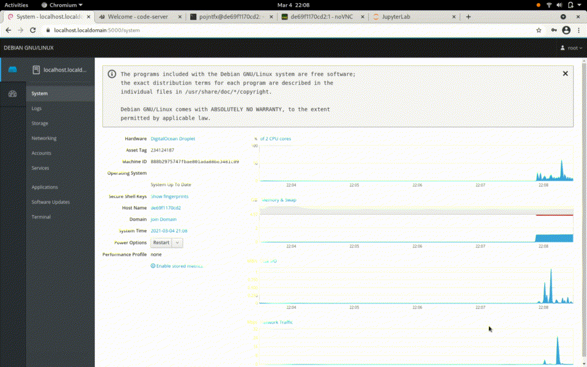

# pojde Next Generation (pojde-ng)

[](https://github.com/pojntfx/pojde-ng/actions/workflows/docker.yaml)



## Overview

🚧 This project is still a work-in-progress! 🚧

pojde Next Generation is a distributed multi-tenant development environment with web access to all components.

It strives to be ...

- **Open**: Free/libre and open source software under the AGPL-3.0 license
- **Versatile:** Supports multiple isolated instances on one host (for multi-user or multi-usecase support)
- **Fast:** Minimal base image with optional modules for languages and tools
- **Portable:** Runs on both Intel/AMD and ARM and requires Docker as the only dependency
- **Lean**: Built on projects like [code-server](https://github.com/cdr/code-server) and [JupyterLab](http://jupyterlab.io/)

With pojde Next Generation, you can **develop from any device with a browser!**

## Installation

To install `pojdectl-ng`, the management tool for pojde Next Generation, paste the following into your terminal:

```shell
curl https://raw.githubusercontent.com/pojntfx/pojde-ng/main/bin/pojdectl-ng | bash -s -- upgrade-pojdectl-ng
```

Works on Linux, macOS and Windows (WSL2).

## Usage

pojde Next Generation is supports running many isolated instances on host, where the host can be your local machine, a cloud server or even a Raspberry Pi. Before you continue to the next step, please [install Docker](https://docs.docker.com/get-docker/) on the host that you wish to run the instance on.

To create your first instance, use `pojdectl-ng apply`:

```shell
$ pojdectl-ng apply my-first-instance 5000 # Append `-n root@your-ip:ssh-port` to create the instance on a remote host instead
```

Now follow the instructions. `pojdectl-ng apply` will ask you to download the CA certificate to your system, which you should do when creating the first instance; future instances will share this certificate. To trust the CA certificate, follow the videos we've created for you:

- [Trusting self-signed SSL certificates (Chrome on Linux)](https://www.youtube.com/watch?v=byFN8vH2SaM)
- [Trusting self-signed SSL certificates (Chrome on macOS)](https://www.youtube.com/watch?v=_PJc7RcMnw8)
- [Trusting self signed SSL certificates (Chrome on Windows)](https://www.youtube.com/watch?v=gyQ9IIxE3vc)

Note that you'll have to **select the CA certificate you've downloaded in the step before**, not download the certificate as described in the videos.

Once you've done so, list your instances with `pojdectl-ng list`:

```shell
$ pojdectl-ng list # Append `-n root@your-ip:ssh-port` to list the instances on a remote host instead
NAME                           STATUS     PORTS
my-first-instance              running    5000-5005
```

As you can see, our first instance (`my-first-instance`) is running and has exposed ports **5000** through **5005**. This port range has been selected when we ran `pojdectl-ng apply` above. You can now access the services (replace `localhost` with your remote host's IP or domain if you deployed to a remote host):

| Service                                           | Address                 | Description                            |
| ------------------------------------------------- | ----------------------- | -------------------------------------- |
| [Cockpit](https://cockpit-project.org/)           | https://localhost:5000/ | A general management interface         |
| [code-server](https://github.com/cdr/code-server) | https://localhost:5001/ | VSCode in the browser                  |
| [ttyd](https://tsl0922.github.io/ttyd/)           | https://localhost:5002/ | Shell access from the browser          |
| [noVNC](https://novnc.com/info.html)              | https://localhost:5003/ | Graphical access from the browser      |
| [JupyterLab](http://jupyterlab.io/)               | https://localhost:5004/ | An interactive development environment |

Additionally, there is a SSH server running on port `5005` which you can use to forward ports with `pojdectl-ng forward`:

```shell
$ pojdectl-ng forward my-first-instance 4200:1234 4201:1235 # Append `-n root@your-ip:ssh-port` to also forward from the remote host to the local host
```

This, for example, forwards port `1234` in the instance to port `4200` on the local host and port `1235` to port `4201`.

**🚀 That's it!** We hope you enjoy using pojde Next Generation.

## Modules

pojde Next Generation is based on a minimal base image; additional functionality can be added by enabling any of the following modules when running `pojdectl-ng apply`:

## Language Modules

- **C/C++**: GCC, GDB, CMake, the C/C++ VSCode extensions and C++ Jupyter kernel
- **Go**: Go, TinyGo, the Go/TinyGo VSCode extensions and Go Jupyter kernel
- **Python**: Python, pip, the Python VSCode extensions and Python Jupyter kernel
- **Rust**: Rust, Cargo, the Rust VSCode extensions and Rust Jupyter kernel
- **JavaScript**: Node, the JavaScript VSCode extensions and JavaScript Jupyter kernel
- **Ruby**: Ruby, the Ruby VSCode extensions and Ruby Jupyter kernel
- **C#**: Mono, .NET, the C# VSCode extensions and C#/F#/PowerShell Jupyter kernels
- **Java**: Java, Maven, Gradle, the Java VSCode extensions and Java Jupyter kernel
- **Julia**: Julia, the Julia VSCode extensions and Julia Jupyter kernel
- **Octave**: Octave, the Octave VSCode extensions and Octave Jupyter kernel
- **R**: R, the R VSCode extensions and R Jupyter kernel
- **SQL**: SQLite, MariaDB, PostgreSQL, the SQL VSCode extensions and SQL Jupyter kernel
- **Bash**: Bash, the Bash VSCode extensions and Bash Jupyter kernel

## Tool Modules

- **Vim**: Vim and the VSCodeVim extension
- **QEMU, Docker and Kubernetes**: `kubectl`, `helm`, `k9s`, `skaffold`, `k3d` and more DevOps tools
- **Technical Documentation**: `pandoc`, `plantuml`, `gnuplot`, media and Markdown/LaTeX support for VSCode
- **Full LaTeX Support**: Full TeX Live installation
- **Web Development**: Protobuf, GraphQL, OpenAPI, browser debugging and more VSCode extensions
- **Common VSCode Extensions**: Prettier, GitLens, Git Graph and test explorer VSCode extensions
- **Common CLIs**: `tmux`, `jq`, `htop` etc.
- **Networking**: Wireshark, `nmap`, `iperf3` etc.
- **Browsers and Mail (TUI)**: `lynx`, `links`, `aerc` etc.
- **Browsers and Mail (GUI)**: Chromium, Firefox, GNOME Web and Thunderbird
- **Multimedia**: `ffmpeg`, Handbrake, `youtube-dl` etc.

## Reference

```shell
$ pojdectl-ng --help
pojdectl-ng is the management tool for pojde Next Generation.
Global Flags:
[-n]ode <user@host:port>            Remote host to execute on.
                                    If not specified, execute locally.

Modification Commands:
apply <name> <startPort>            Create or upgrade an instance.
    [-f]orce                            Skip confirmation prompts.
    [-u]pgrade                          Pull latest image.
    [-r]recreate                        Re-create the container.
    [-i]solate                          Block Docker daemon access.
remove [name...]                    Remove instances(s).
    [-f]orce                            Skip confirmation prompts.
    [-c]ustomization                    Remove customizations.
    [-p]references                      Remove preferences.
    [-s]ecurity                         Remove CA.
    [-u]ser data                        Remove user data.
    [-d]eb cache                        Remove .deb cache.
    [-a]ll                              Remove everything.
list                                List all instances.

Lifecycle Commands:
start [name...]                     Start instance(s).
stop [name...]                      Stop instance(s).
restart [name...]                   Restart instance(s).

Utility Commands:
logs <name>                         Get the logs of an instance.
enter <name>                        Get a shell in an instance.
forward <name> [local:remote...]    Forward port(s) from an instance.

Miscellaneous Commands:
upgrade-pojdectl-ng                 Upgrade this tool.
reset-ca [-f]orce                   Reset the CA.

For more information, please visit https://github.com/pojntfx/pojde-ng#Usage.
```

## License

pojde Next Generation (c) 2021 Felix Pojtinger and contributors

SPDX-License-Identifier: AGPL-3.0
